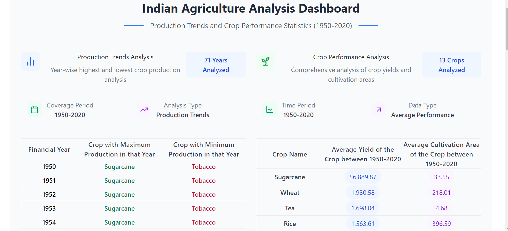
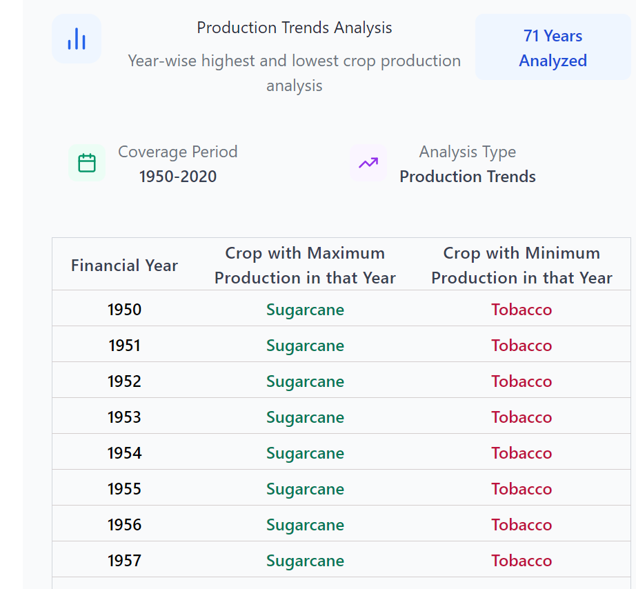
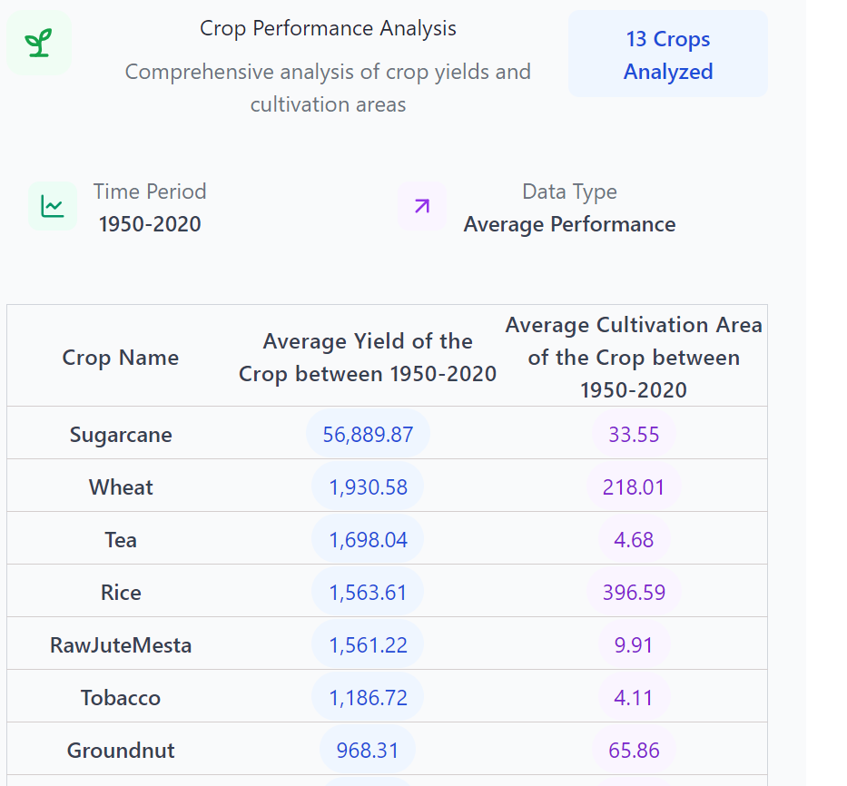

# Indian Agriculture Analysis Dashboard

A comprehensive dashboard for analyzing Indian agricultural data, featuring production trends and crop performance statistics from 1950 to 2020.

## 📊 Screenshots

### Full Dashboard View


### Individual Components

#### Production Trends Analysis


#### Crop Performance Analysis


## 🚀 Features

### Production Trends Analysis
- Year-wise analysis of crop production
- Identifies highest and lowest producing crops for each year
- Visual indicators for production trends
- Clean and intuitive data presentation

### Crop Performance Statistics
- Comprehensive crop-wise performance metrics
- Average yield calculations (Kg/Ha)
- Cultivation area analysis
- Sorted by yield performance

## 💻 Technologies Used

- **React.js** - Frontend framework
- **TypeScript** - Type safety and better development experience
- **Mantine UI** - Component library for consistent UI
- **Tailwind CSS** - Utility-first CSS framework
- **Lucide React** - Icon library

## 🛠️ Project Structure

```
src/
├── components/
│   ├── AgricultureDashboard.tsx   # Production trends analysis
│   └── CropStatistics.tsx         # Crop performance statistics
├── data/
│   └── data.json                  # Agricultural data
├── App.tsx                        # Main application component
└── index.tsx                      # Entry point
```

## 📋 Implementation Details

### Data Processing
- Groups agricultural data by year and crop
- Calculates averages and identifies trends
- Implements sorting for better data visualization

### UI Components
- Responsive design for all screen sizes
- Interactive tables with hover effects
- Clear visual hierarchy
- Consistent color scheme and typography

## 🔧 Setup and Installation

1. Clone the repository:
```bash
git clone [https://github.com/bablysingh2409/agriculture-analysis.git]
```

2. Install dependencies:
```bash
npm install
```

3. Start the development server:
```bash
npm run dev
```